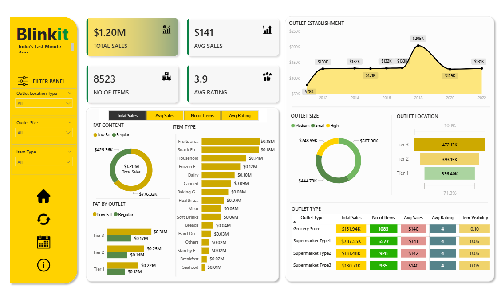

# Blinkit Power BI Dashboard

## 📊 Project Overview
This Power BI project is based on Blinkit’s sales data.  
I created an interactive dashboard to explore how different products, outlet sizes, and locations affect overall sales performance.  
The goal was to turn raw data into clear, visual insights that can help understand business patterns and make data-driven decisions.

## 🎯 Objectives
- To analyze total sales, average ratings, and item visibility.
- To find which product categories perform the best.
- To compare outlet sales by size and location.
- To understand customer behavior and trends from the data.

## 💡 Key Insights
- Larger outlets with higher visibility tend to perform better.
- Some product categories consistently show higher sales than others.
- There’s a clear connection between product ratings and customer demand.

## 🧰 Tools Used
- **Power BI** – for data modeling and visualization.  
- **Excel / CSV Dataset** – used as the data source.

## 📈 Features
- Clean and easy-to-understand dashboard layout.
- Visual filters for outlet type, location, and item type.  
- KPIs for total sales, average rating, and total items.  
- Different charts to compare sales and performance across outlets.

## 📁 File Details
- **Blinkit.pbix** – the main Power BI file containing the dashboard and visuals.
